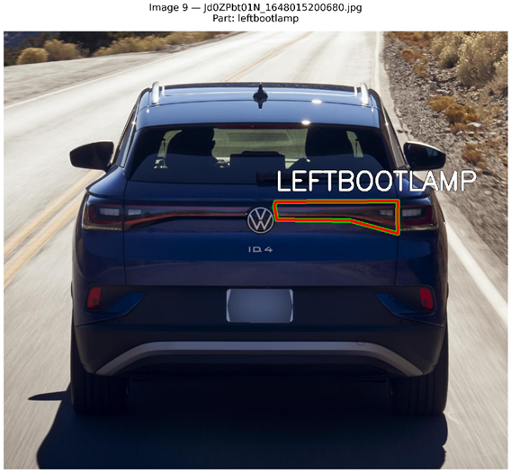
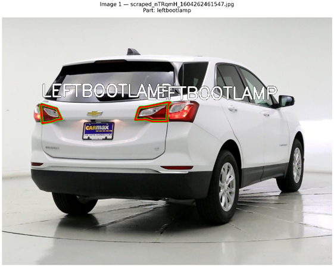
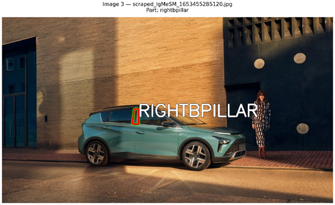
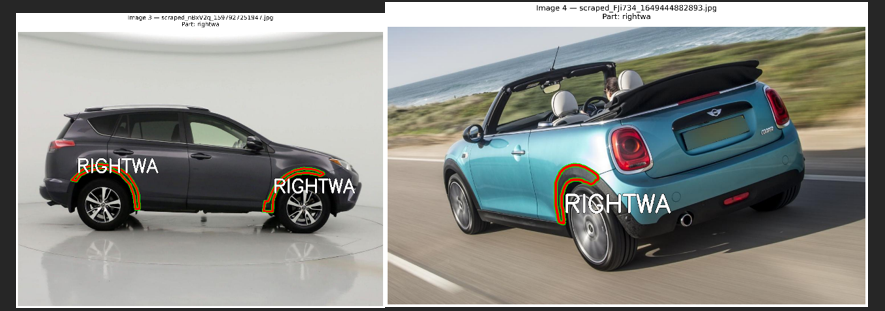
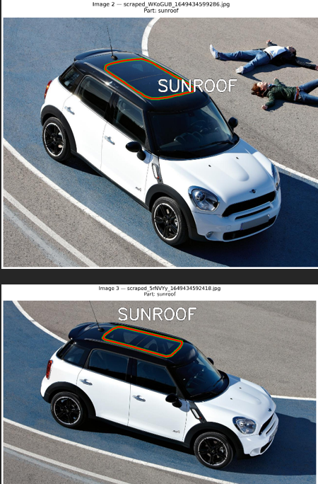

# Car View Classifier

This repository has code and trained models that can look at a picture of a car and tell you what side (or "view") is showing. The classes it can recognize are: `Front`, `Front_Left`, `Front_Right`, `Rear`, `Rear_Left`, `Rear_Right`, and `Unknown`.

## Folders & Files

- **Training Notebooks**: 
  - `EfficientNetB0.ipynb`
  - `MobileNetV3Large.ipynb`
- **Trained Models**:
  - `best_efficientnetb0_car_view.tflite`
  - `best_mobilenetv3large_car_view.tflite`
- **Testing Script**: 
  - `test_run.py` - A simple python script you can run to test images.

---

## How I Processed the Data

I built my dataset by looking at the specific parts of the car labeled in the images and mapping those parts to a car side. 

### Figuring Out the View (Front, Rear, Left, etc.)
I created a list (`PART_TO_VIEW`) to link car parts to specific sides:
- For example, if I saw a `frontws` (front windshield) or a `logo`, I marked the image as `Front`.
- If the part had a clear name like `leftheadlamp`, I marked it as `Front_Left`.
- If an image had parts from multiple sides, I looked at the most important parts to make a final decision.

### Assumptions I Made
To make things easier, I had to assume a few things based on the real world:
- **`fuelcap` (Gas tank door)**: I assumed this is on the **Left** side. This is common for cars in India (where the data is from), but might be different elsewhere.
- **`antenna`**: I assumed this is at the **Rear** (back) of the car.

---

## Issues With the Images

I found a few problems with the dataset that hurt the model's accuracy.

1. **Wrong Labels**: Some images simply had the wrong labels given by the people who made the dataset.
   
   
   
   

2. **Confusing Parts**: 
   - `rightbpillar`: The B-pillar is right in the middle of the car doors, so it's hard to say if it means the picture is of the front or the back.
     
     
     
   - `rightwa`: This label was just confusing. It wasn't clear if it should belong to the Front or the Rear.
     
     
     
   - `roofrail` & `sunroof`: These don't help much because you can see the roof of a car from almost any angle.
     
     

3. **Skipped Parts (`AMBIGUOUS_PARTS`)**:
   I had to ignore many parts completely because they don't help tell you what side you're looking at. These were:
   - **Top of car**: `roof`, `sunroof`, `roofrail`
   - **Wheels & Tyres**: things like `alloywheel`, `wheelcap`, or `tyre` (wheels look the same from the front-side or rear-side).
   - **Lamps**: generic `indicator` or broken/faded lamps.
   - **Doors & Windows**: generic parts like `doorhandle` or `doorglass`.

### What I Also Tried: YOLO
I tried using a popular tool called **YOLO** to find and classify the cars, but it didn't work. The model just memorized the few training images I had (called "overfitting") because there weren't enough pictures. Because of this, I went back to using standard EfficientNet and MobileNet models.

---

## How to Test It Yourself

### 1. Requirements
Make sure you have Python installed, then install all the necessary packages I used for my code and notebooks:
```bash
pip install tensorflow numpy pandas opencv-python matplotlib ipython
```

### 2. Folder Setup
Create a folder named `test` in the same folder as `test_run.py`. Put the car pictures you want to test inside it (`.jpg`, `.jpeg`, or `.png`).

```text
car-view-classifier/
│
├── test/
│   ├── image1.jpg
│   └── image2.png
│
├── best_efficientnetb0_car_view.tflite
└── test_run.py 
```

### 3. Run the Code

> [!IMPORTANT]
> - Make sure your python code uses exactly these classes:
>   `class_names = ['Front', 'Front_Left', 'Front_Right', 'Rear', 'Rear_Left', 'Rear_Right', 'Unknown']`
> - I highly recommend using the **EfficientNetB0** model (`best_efficientnetb0_car_view.tflite`) because it works best.

Open your terminal and run:
```bash
python test_run.py
```

### 4. Results
The script will check every image in your `test` folder. 
- It will print the guess on your screen.
- At the end, it will create a `predictions.csv` file with all the results saved for you.
